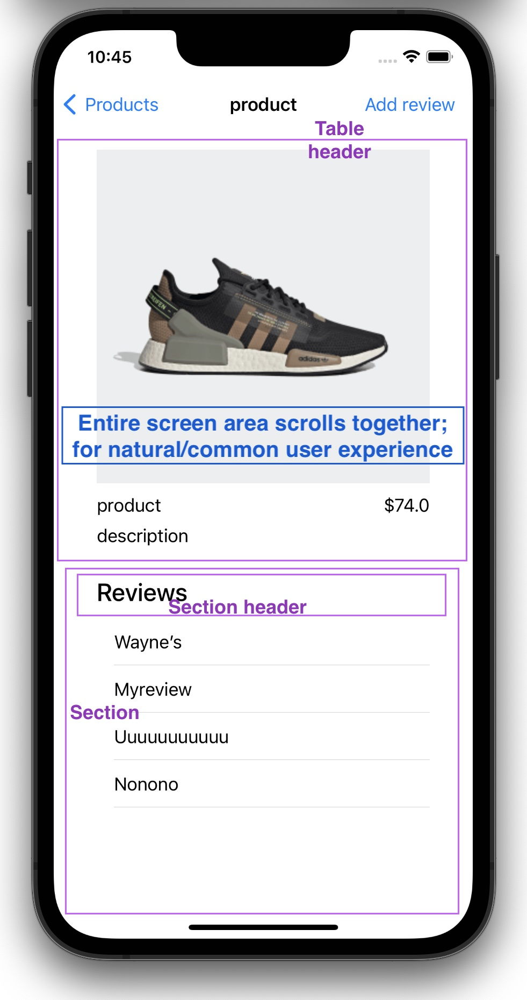

## Notes

Asignemt took between 5-6 hours to complete.
Solution was typed top to bottom, without use of online or previous materials.
(with 1 exception; Add Review presentation popup was copied form web, to save time)

Emphasis on architecture, not on UI. Reason, with correct architecture, localized updates to UI are enabled with no risk. With time allocation, can implement correct any UI/UX.

Architecture used is described below.

**Task description comments**
**App resilience. What happens if we run out of internet conection?**

Network errors, as any other error, will be handled according to accepted policy.
In current implementation, error handling is adjustable; simple message alert will be shown.

**App stability. (Crashes)**

A tool like Firebase/Crashlytics can be used, as well as optional message for the user.
Have experience using Crashlytics in large production apps (post-release, monitoring, analysis) as well as in small private apps.

**Testing**

Implemented few unittests; showing an approach.
Correct dependency injection is used in assignment, enables unittesting of business logic.
Integration tests (UI tests) may/should be considered in production - as they provide much more quality assurance, at higher cost.

**App architecture**

Used MVVM-C, with correct dependency injection for code testability.
Coordinator (C) implements navigation logic.

**UI/UX**

Implemented plain UI from assignment desription, proving functionality. UI improvement suggestion below.

**Building app. (Dependency management)**

No third party dependencies are added for this asignment. Here are my general toughts on d.managers.

Unpopularly, Carthage is my first choice - as i value simplicity and control.
Carthage compiles dependencies, eliminating additinal compilation time, which is impact in bigger projects with many dependencies. Integrating is a simple task with Xcode, and leaves you in control.

SwiftPM is my second choice, is modern and is an intergrated Xcode tool. Although higher adoption among dev community is desired.

Cocoapods is ithink most popular among community; although has big drawbacks -high maintenance cost, especially in complex setup; -adds significant compilation time with many dependencies; -other smaller drawbacks.

*Suggestion to improve Product screen UI*

As opposed to "Reviews" being scrollable, below is suggestion

